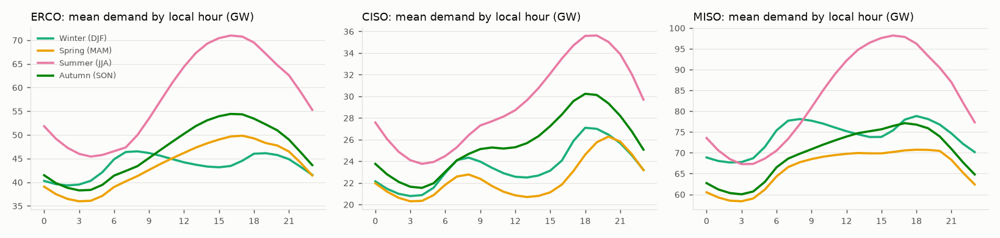
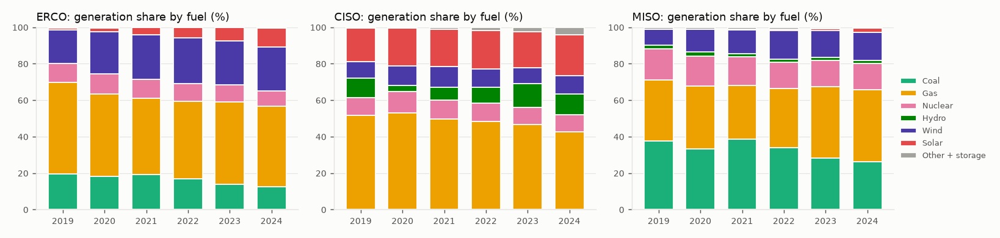
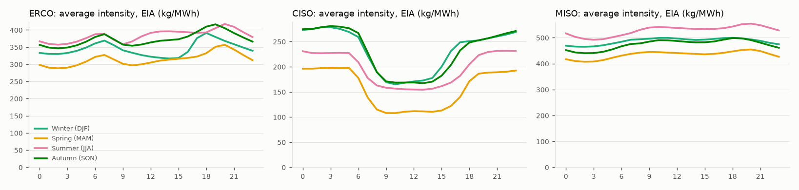
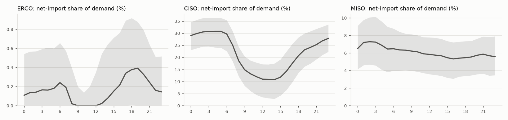
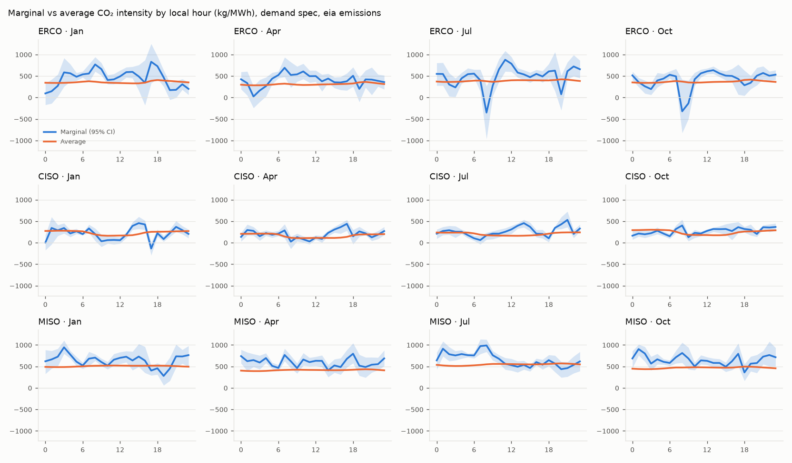
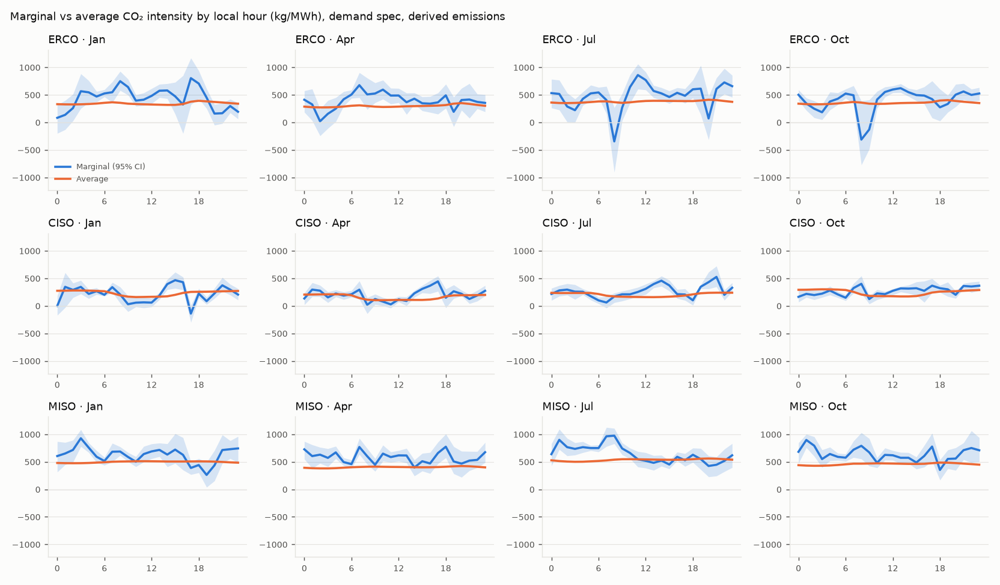
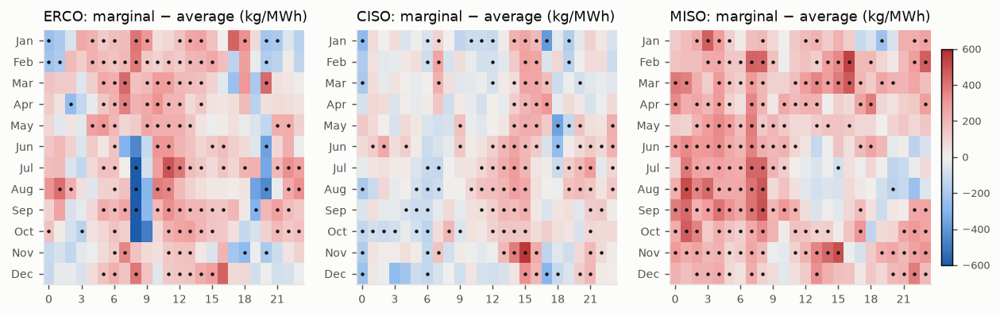
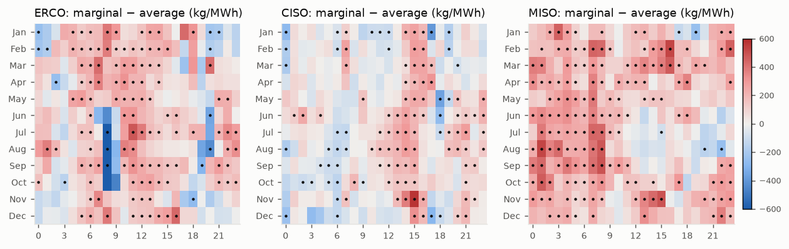

# Marginalis: EDA and marginal emissions factors (train split)

_Generated by `marginalis analyze` at 2026-09-27 08:25 UTC from `v_hour_train` / `v_hour_delta_train` only (2019-07-01 → 2025-01-01). Hold-out data (2025, 2026 YTD) has not been read; `METHOD_FROZEN` is False. Every number below is computed by `src/marginalis/analysis/`; none is typed in._

## Summary

- **MISO: the hours that look cleanest on average are dirty at the margin.** The average-intensity profile picks an overnight 4-hour window (starting 00:00–04:00) in 12 of 12 months. Across those overnight hours, each extra MWh of demand came with **732 kg CO₂** (95% CI 703–760), against an average intensity of 459 kg/MWh.
- With demand as the regressor, marginal and average differ by ≥ 50 kg/MWh with a CI excluding zero in ERCO 122, CISO 112, MISO 152 of 288 month × hour strata (counted where the derived and EIA series agree). In ERCO and MISO, nearly all of these have the marginal factor **above** average. CISO is mixed: above average in the mid-afternoon and on summer middays, below it at winter middays.
- Single strata are noisy: the median 95% CI width for the demand spec is ERCO 354, CISO 177, MISO 297 kg/MWh. Profiles are informative in aggregate and should not be read hour by hour.
- The pre-registered test (hold-out scheduler comparison, W = 4 h, ≥ 50 kg CO₂/MWh shifted + CI) **has not been run**. Nothing here is its result.

## Methodology used

As fixed in `docs/preregistration.md` (Estimation details and the 2026-09-27 amendments), before any factor was estimated:

- **Strata:** BA × spec × emissions source × month × local hour (start of hour, BA zone; MISO Central). Specs: `demand` (main) and `fossil_gen` (robustness). Sources: `derived` (generation × fixed fuel rate) and `eia` (EIA's published hourly estimate).
- **Estimator:** OLS with intercept, ΔCO₂ = α + β·Δx + ε, per stratum; β is the marginal factor.
- **CIs:** cluster bootstrap over local calendar weeks, 2,000 replicates, seed 20260927, percentile 95%. The marginal-minus-average difference is bootstrapped jointly.
- **Minimum cell size:** 120 usable observations, with pooling of adjacent months if below. Every cell met it (minimum n = 141), so **no strata were pooled**.
- **Average baseline:** Σ CO₂ / Σ net generation over the stratum's hours, per source, excluding the CISO hydro/other gap hours and the gas-as-Other days.
- **Divergence (descriptive, in-sample):** |β − average| ≥ 50 kg/MWh and the bootstrap CI of the difference excludes zero.
- **Excluded delta rows:** the previous hour is not the adjacent UTC hour; either hour interpolated; NULL regressor or ΔCO₂; incomplete fossil data (derived only); either hour on a gas-as-Other day.

| BA | spec | delta rows | usable | excluded | excluded % | on gas-as-Other days |
|---|---|---|---|---|---|---|
| CISO | demand | 48,264 | 48,061 | 203 | 0.42 | 0 |
| CISO | fossil_gen | 48,264 | 48,065 | 199 | 0.41 | 0 |
| ERCO | demand | 48,264 | 48,117 | 147 | 0.30 | 120 |
| ERCO | fossil_gen | 48,264 | 48,117 | 147 | 0.30 | 120 |
| MISO | demand | 48,264 | 48,210 | 54 | 0.11 | 0 |
| MISO | fossil_gen | 48,264 | 48,210 | 54 | 0.11 | 0 |

## EDA

### Demand

| year | CISO | ERCO | MISO |
|---|---|---|---|
| 2019 | 26.5 | 46.6 | 76.0 |
| 2020 | 24.8 | 43.4 | 71.1 |
| 2021 | 25.0 | 44.8 | 73.3 |
| 2022 | 25.5 | 49.2 | 74.6 |
| 2023 | 24.9 | 51.0 | 73.2 |
| 2024 | 25.5 | 52.8 | 73.6 |

2019 covers July–December only, so its means lean towards summer. From 2020 to 2024, ERCO demand grew from 43.4 GW to 52.8 GW; CISO and MISO were roughly flat. All three peak in summer late afternoon (≈16:00–19:00 local). ERCO and MISO have the steepest summer ramps.

### Generation mix

| BA | year | Coal | Gas | Nuclear | Hydro | Wind | Solar | Other + storage |
|---|---|---|---|---|---|---|---|---|
| CISO | 2019 | 0.1 | 51.8 | 9.6 | 10.5 | 9.1 | 18.4 | 0.5 |
| CISO | 2020 | 0.1 | 53.0 | 11.7 | 3.2 | 10.7 | 20.7 | 0.5 |
| CISO | 2021 | 0.1 | 49.5 | 10.3 | 7.1 | 11.4 | 20.5 | 1.0 |
| CISO | 2022 | 0.0 | 48.1 | 10.3 | 8.6 | 10.1 | 20.9 | 1.9 |
| CISO | 2023 | 0.0 | 46.6 | 9.4 | 13.0 | 8.7 | 19.8 | 2.4 |
| CISO | 2024 | 0.0 | 42.8 | 9.2 | 11.4 | 10.1 | 22.5 | 4.1 |
| ERCO | 2019 | 19.5 | 50.1 | 10.3 | 0.1 | 18.5 | 1.1 | 0.3 |
| ERCO | 2020 | 18.1 | 45.2 | 11.0 | 0.2 | 22.9 | 2.2 | 0.4 |
| ERCO | 2021 | 19.2 | 41.9 | 10.3 | 0.1 | 24.4 | 3.9 | 0.2 |
| ERCO | 2022 | 16.8 | 42.6 | 9.8 | 0.1 | 25.0 | 5.5 | 0.3 |
| ERCO | 2023 | 14.0 | 45.2 | 9.2 | 0.1 | 24.2 | 7.1 | 0.3 |
| ERCO | 2024 | 12.7 | 44.0 | 8.4 | 0.1 | 24.1 | 10.3 | 0.5 |
| MISO | 2019 | 37.7 | 33.4 | 17.2 | 1.8 | 8.9 | 0.1 | 1.0 |
| MISO | 2020 | 33.3 | 34.3 | 16.6 | 2.0 | 12.4 | 0.1 | 1.1 |
| MISO | 2021 | 38.7 | 29.3 | 15.6 | 1.7 | 13.1 | 0.3 | 1.2 |
| MISO | 2022 | 33.9 | 32.6 | 14.4 | 1.7 | 15.6 | 0.7 | 1.1 |
| MISO | 2023 | 28.4 | 39.1 | 14.2 | 1.6 | 14.9 | 1.0 | 0.7 |
| MISO | 2024 | 26.3 | 39.6 | 14.3 | 1.7 | 15.4 | 2.3 | 0.4 |

Coal's share fell in ERCO (19.5% → 12.7%) and MISO (37.7% → 26.3%). In MISO gas took its place (33.4% → 39.6%). In ERCO gas also fell (50.1% → 44.0%) as solar grew (1.1% → 10.3%). CISO is gas plus solar (gas 51.8% → 42.8%), with hydro swinging with water years; its 2020 hydro share is low partly because of the reporting gap.

### Emissions and average intensity

| BA | year | avg intensity derived (kg/MWh) | avg intensity eia (kg/MWh) |
|---|---|---|---|
| CISO | 2019 | 175 | 181 |
| CISO | 2020 | 248 | 254 |
| CISO | 2021 | 208 | 210 |
| CISO | 2022 | 202 | 202 |
| CISO | 2023 | 198 | 198 |
| CISO | 2024 | 185 | 186 |
| ERCO | 2019 | 406 | 412 |
| ERCO | 2020 | 372 | 380 |
| ERCO | 2021 | 368 | 377 |
| ERCO | 2022 | 346 | 355 |
| ERCO | 2023 | 328 | 343 |
| ERCO | 2024 | 310 | 324 |
| MISO | 2019 | 523 | 528 |
| MISO | 2020 | 482 | 495 |
| MISO | 2021 | 517 | 520 |
| MISO | 2022 | 481 | 494 |
| MISO | 2023 | 451 | 460 |
| MISO | 2024 | 431 | 441 |

Average intensity (EIA) fell steadily in ERCO (380 → 324 kg/MWh, 2020–2024) and MISO (495 → 441). CISO's 2019 and 2020 figures cover partial, autumn-heavy periods (2019 starts in July; the hydro gap is excluded), so its trend is only readable from 2021 (210 → 186). The derived series tracks EIA's closely, running slightly lower (EIA's factors are BA-and-year specific and assign some CO₂ to 'Other'). CISO's average intensity collapses around midday (solar). MISO's is highest and flattest.

### Hour-to-hour changes (the regressor)

| BA | sd | p1 | p5 | p50 | p95 | p99 | corr(Δdemand, Δfossil) |
|---|---|---|---|---|---|---|---|
| CISO | 1,104.26 | -2,577.42 | -1,711.10 | -86.00 | 1,835.00 | 2,365.42 | 0.62 |
| ERCO | 1,870.36 | -3,962.38 | -3,057.00 | -4.00 | 3,319.00 | 4,279.38 | 0.75 |
| MISO | 2,216.14 | -5,053.63 | -3,608.00 | -101.50 | 3,870.00 | 5,126.00 | 0.93 |

Δdemand is roughly symmetric around zero with a diurnal structure. Δdemand and Δfossil generation are most tightly coupled in MISO and least in CISO, where imports, hydro and storage absorb a large share of load changes.

### Net imports

| BA | year | net-import share, mean % | net-import share, p95 % |
|---|---|---|---|
| CISO | 2019 | 26.1 | 36.3 |
| CISO | 2020 | 27.8 | 42.1 |
| CISO | 2021 | 25.3 | 42.0 |
| CISO | 2022 | 22.2 | 40.2 |
| CISO | 2023 | 14.1 | 29.7 |
| CISO | 2024 | 14.8 | 31.5 |
| ERCO | 2019 | 0.4 | 1.3 |
| ERCO | 2020 | 0.4 | 1.4 |
| ERCO | 2021 | 0.4 | 1.5 |
| ERCO | 2022 | 0.5 | 1.5 |
| ERCO | 2023 | 0.3 | 1.1 |
| ERCO | 2024 | 0.2 | 0.8 |
| MISO | 2019 | 7.6 | 11.9 |
| MISO | 2020 | 9.3 | 14.4 |
| MISO | 2021 | 5.6 | 9.6 |
| MISO | 2022 | 5.0 | 10.5 |
| MISO | 2023 | 6.0 | 10.9 |
| MISO | 2024 | 3.7 | 8.5 |

CISO imports a large share of its demand, so its in-BA marginal factors miss emissions in imported power. MISO is moderate and ERCO is near-isolated (the cleanest case).

### Data issues and how they were handled

- **CISO hydro/other gap** (7,869 train hours, Oct 2019 – Aug 2020). EIA's net generation omits hydro and other, so net generation / demand drops from a mean of 0.78 outside the gap to 0.60 inside it. Average intensity computed naively inside the gap would be 229 kg/MWh, an overstatement. These hours are **excluded from the average baseline** but kept in the MEF regressions (demand, fossil generation and CO₂ are unaffected).
- **Small negative thermal generation** (CISO COL 3,546 h, CISO OIL 948 h) is station load at idle units, counted as zero CO₂. Counting it as negative emissions instead would change CISO's derived CO₂ by -0.0044%, which is negligible.
- **Storage codes mid-sample.** ERCO reports BAT/UES from 2024-11-06 (1,338 train hours; |storage| = 2.1% of net generation). Storage carries no direct CO₂ here, so no exclusion was needed. MISO's storage codes start in 2025 (hold-out) and are not seen. **CISO reports its batteries inside 'Other'**: evening (18–21h) mean OTH rose from 10 MWh (2019) to 3,169 MWh (2024), while midday (10–14h) went to -3,293 MWh (charging).
- **Gas reported as 'Other'** on 5 ERCO days (2019-12-18, 2020-01-08, 2020-01-15, 2020-01-22, 2020-03-18): ~20 GW of gas sits under Other for a whole local day, corrupting both CO₂ series and producing ±25 GW fossil deltas at the day boundaries. Found in EDA before estimation, and excluded by amendment.

## Marginal emissions factors

`mef_profile` holds 3,456 rows (3 BAs × 2 specs × 2 sources × 12 months × 24 hours). Full diagnostics per stratum (difference, its CI, clusters, divergence flag) are in `reports/mef_strata_detail.csv`.

| BA | spec | source | median MEF | MEF p10 | MEF p90 | median average | median CI width | median n | diverging strata (of 288) | marginal above | marginal below |
|---|---|---|---|---|---|---|---|---|---|---|---|
| CISO | demand | derived | 224 | 79 | 394 | 200 | 178 | 164 | 113 | 77 | 36 |
| CISO | demand | eia | 224 | 80 | 388 | 201 | 177 | 164 | 117 | 78 | 39 |
| CISO | fossil_gen | derived | 409 | 408 | 409 | 200 | 1 | 164 | 288 | 288 | 0 |
| CISO | fossil_gen | eia | 405 | 402 | 408 | 201 | 4 | 164 | 288 | 288 | 0 |
| ERCO | demand | derived | 458 | 185 | 624 | 340 | 345 | 166 | 123 | 108 | 15 |
| ERCO | demand | eia | 468 | 193 | 640 | 351 | 354 | 166 | 123 | 107 | 16 |
| ERCO | fossil_gen | derived | 559 | 509 | 605 | 340 | 80 | 166 | 286 | 286 | 0 |
| ERCO | fossil_gen | eia | 570 | 516 | 619 | 351 | 85 | 166 | 285 | 285 | 0 |
| MISO | demand | derived | 626 | 460 | 804 | 467 | 298 | 167 | 157 | 152 | 5 |
| MISO | demand | eia | 641 | 479 | 814 | 476 | 297 | 167 | 162 | 159 | 3 |
| MISO | fossil_gen | derived | 685 | 627 | 744 | 467 | 91 | 167 | 281 | 281 | 0 |
| MISO | fossil_gen | eia | 695 | 640 | 753 | 476 | 87 | 167 | 281 | 281 | 0 |

**Reading the fossil_gen spec.** It is close to mechanical. The derived CO₂ series *is* Σ rate × fossil generation, and EIA's is built the same way, so regressing ΔCO₂ on Δfossil generation recovers the rate of whichever fossil fuel ramps: CISO ≈ 409 (gas only), MISO ≈ 690 and ERCO ≈ 560 (coal + gas). It sits above average intensity by construction, because average intensity includes zero-carbon generation. So its '288 of 288 diverging' says which fuel ramps, not how to schedule load. The demand spec answers the scheduling question.

### Strata where marginal and average diverge (demand spec)

Dots mark strata meeting the descriptive rule. Red means marginal is above average.

Largest divergences where both sources agree (EIA values shown):

| BA | month | hour | MEF | CI low | CI high | average | MEF − avg | diff CI low | diff CI high | n_obs |
|---|---|---|---|---|---|---|---|---|---|---|
| ERCO | Aug | 08:00 | -727 | -1,233 | 33 | 386 | -1,113 | -1,611 | -368 | 186 |
| ERCO | Sep | 08:00 | -344 | -881 | 251 | 394 | -738 | -1,278 | -147 | 180 |
| ERCO | Jul | 08:00 | -351 | -966 | 268 | 378 | -729 | -1,343 | -118 | 186 |
| CISO | Nov | 15:00 | 770 | 643 | 889 | 207 | 563 | 435 | 682 | 178 |
| MISO | Feb | 16:00 | 1,014 | 668 | 1,354 | 475 | 538 | 180 | 883 | 142 |
| MISO | Aug | 01:00 | 1,020 | 759 | 1,277 | 509 | 511 | 248 | 771 | 186 |
| MISO | Nov | 15:00 | 963 | 752 | 1,189 | 464 | 500 | 278 | 732 | 180 |
| MISO | Sep | 08:00 | 995 | 806 | 1,184 | 499 | 496 | 307 | 687 | 180 |
| ERCO | Jul | 11:00 | 878 | 607 | 1,085 | 390 | 488 | 214 | 702 | 185 |
| MISO | Aug | 08:00 | 1,017 | 825 | 1,177 | 536 | 482 | 283 | 649 | 186 |
| ERCO | Aug | 20:00 | -18 | -261 | 239 | 428 | -446 | -691 | -189 | 186 |
| CISO | Jan | 17:00 | -136 | -292 | 9 | 253 | -388 | -544 | -243 | 155 |
| CISO | Nov | 14:00 | 554 | 437 | 653 | 177 | 377 | 263 | 474 | 178 |
| CISO | May | 18:00 | -213 | -398 | -12 | 144 | -357 | -550 | -142 | 155 |
| CISO | Dec | 15:00 | 549 | 308 | 808 | 228 | 321 | 79 | 579 | 185 |

- **MISO:** marginal is above average in most overnight and morning strata (00:00–09:00), when coal and gas follow load and wind fills the average. Divergence thins out on summer afternoons.
- **ERCO:** marginal is above average across most daytime strata. It turns **negative** at 08:00 and around 20:00 in summer, when demand rises while solar ramps up faster (or falls while solar ramps down). This is confounding the no-controls specification cannot separate, and it is not a real negative marginal emission.
- **CISO:** marginal is *above* average in the mid-afternoon (14:00–16:00) in almost every month, and across midday from June to October, when gas follows load. It is *below* average around midday in January–March (extra load absorbs otherwise-curtailed solar or exports) and in several dawn and dusk hours, where solar ramps confound the regression as they do in ERCO. Imports are large, so in-BA factors are a lower bound on the system response.

### What the profiles imply for a 4-hour flexible load (in-sample prediction)

For each month, the shared optimiser (`src/marginalis/schedule.py`) picks the lowest-intensity 4-hour window under each profile. The table gives the marginal factor each choice implies.

| BA | month | marginal-optimal window | average-optimal window | MEF in marginal window | MEF in average window | predicted gap (kg/MWh) |
|---|---|---|---|---|---|---|
| CISO | Jan | 09:00–13:00 | 09:00–13:00 | 54 | 54 | 0 |
| CISO | Feb | 10:00–14:00 | 09:00–13:00 | 82 | 105 | 23 |
| CISO | Mar | 09:00–13:00 | 10:00–14:00 | 78 | 95 | 17 |
| CISO | Apr | 08:00–12:00 | 09:00–13:00 | 65 | 89 | 24 |
| CISO | May | 05:00–09:00 | 07:00–11:00 | 74 | 97 | 22 |
| CISO | Jun | 05:00–09:00 | 12:00–16:00 | 107 | 317 | 211 |
| CISO | Jul | 05:00–09:00 | 11:00–15:00 | 128 | 353 | 225 |
| CISO | Aug | 06:00–10:00 | 10:00–14:00 | 139 | 322 | 183 |
| CISO | Sep | 04:00–08:00 | 10:00–14:00 | 169 | 264 | 95 |
| CISO | Oct | 00:00–04:00 | 11:00–15:00 | 198 | 281 | 82 |
| CISO | Nov | 08:00–12:00 | 09:00–13:00 | 145 | 158 | 14 |
| CISO | Dec | 03:00–07:00 | 09:00–13:00 | 108 | 142 | 34 |
| ERCO | Jan | 20:00–00:00 | 12:00–16:00 | 215 | 541 | 327 |
| ERCO | Feb | 20:00–00:00 | 12:00–16:00 | 228 | 501 | 273 |
| ERCO | Mar | 16:00–20:00 | 00:00–04:00 | 266 | 361 | 94 |
| ERCO | Apr | 01:00–05:00 | 01:00–05:00 | 196 | 196 | 0 |
| ERCO | May | 17:00–21:00 | 00:00–04:00 | 316 | 324 | 8 |
| ERCO | Jun | 06:00–10:00 | 01:00–05:00 | 172 | 433 | 261 |
| ERCO | Jul | 06:00–10:00 | 01:00–05:00 | 221 | 382 | 162 |
| ERCO | Aug | 06:00–10:00 | 00:00–04:00 | 105 | 624 | 519 |
| ERCO | Sep | 07:00–11:00 | 01:00–05:00 | 247 | 438 | 191 |
| ERCO | Oct | 07:00–11:00 | 01:00–05:00 | 114 | 302 | 188 |
| ERCO | Nov | 17:00–21:00 | 00:00–04:00 | 216 | 244 | 28 |
| ERCO | Dec | 00:00–04:00 | 12:00–16:00 | 277 | 525 | 248 |
| MISO | Jan | 17:00–21:00 | 00:00–04:00 | 397 | 738 | 341 |
| MISO | Feb | 10:00–14:00 | 00:00–04:00 | 578 | 636 | 58 |
| MISO | Mar | 08:00–12:00 | 00:00–04:00 | 593 | 690 | 97 |
| MISO | Apr | 13:00–17:00 | 01:00–05:00 | 511 | 638 | 127 |
| MISO | May | 17:00–21:00 | 01:00–05:00 | 537 | 653 | 117 |
| MISO | Jun | 20:00–00:00 | 01:00–05:00 | 458 | 784 | 325 |
| MISO | Jul | 19:00–23:00 | 02:00–06:00 | 500 | 772 | 272 |
| MISO | Aug | 19:00–23:00 | 01:00–05:00 | 411 | 889 | 478 |
| MISO | Sep | 12:00–16:00 | 01:00–05:00 | 506 | 792 | 286 |
| MISO | Oct | 18:00–22:00 | 01:00–05:00 | 557 | 734 | 176 |
| MISO | Nov | 08:00–12:00 | 00:00–04:00 | 526 | 676 | 150 |
| MISO | Dec | 08:00–12:00 | 01:00–05:00 | 537 | 670 | 133 |

Mean predicted gap (kg CO₂ per MWh shifted):

| BA | derived | eia |
|---|---|---|
| CISO | 82 | 78 |
| ERCO | 181 | 191 |
| MISO | 212 | 213 |

These gaps are **optimistic**. The marginal-optimal window is the minimum of 21 noisy window means, picked from the same data the profile was fitted on (winner's curse). Whether they survive is exactly what the pre-registered hold-out comparison will measure.

## Recommendation

**Don't schedule flexible load in MISO overnight just because the grid looks cleanest then.** Tools that use average intensity send MISO flexible load (EV fleet charging, batch computing, water heating) to the overnight hours in 12 of 12 months, but those are among the dirtiest hours at the margin. For a 100 MWh/day load run overnight, average intensity suggests it is responsible for about **16,754 t CO₂/year**. The marginal estimate puts the grid's actual response at about **26,714 t/year** (95% CI 25,653–27,736): **9,960 t/year more**, or 59% above what the average-based figure implies. This number is not selected on the marginal profile, so it doesn't suffer the winner's curse above. Moving the same load to each month's marginal-optimal window is predicted, in-sample, to save about 213 kg/MWh (~7,791 t/year). Treat that as an upper bound until the hold-out test.

## Limitations

- The analysis estimates the average empirical relationship between hour-to-hour changes in load and in in-BA CO₂ within each stratum. It does not identify a causal dispatch response. There are no weather or renewable-output controls (per the pre-registered spec), which is visible in ERCO's solar-ramp hours.
- In-BA emissions only: emissions embodied in imports are not counted. This matters most for CISO (see net-import shares).
- One CO₂ rate per fuel: derived factors reflect which fuel ramps, not the efficiency of the plants that ramp.
- 3,456 strata are many comparisons. The divergence counts are descriptive, not tests.

## Next step

Freeze the method (commit `METHOD_FROZEN = True`), then run the pre-registered evaluation on 2025 and 2026 YTD: the daily W = 4 h scheduler comparison with the ≥ 50 kg CO₂/MWh + CI rule, and the predictive check of these factors against realised ΔCO₂/Δdemand.
